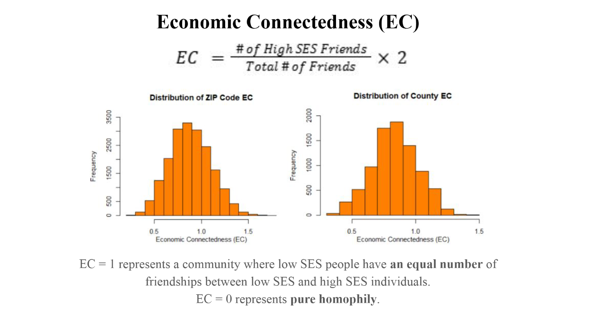
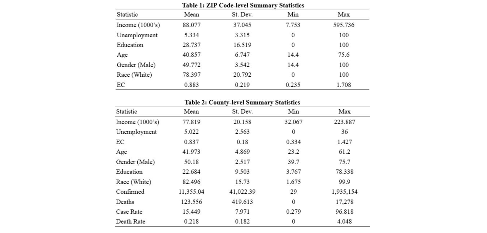
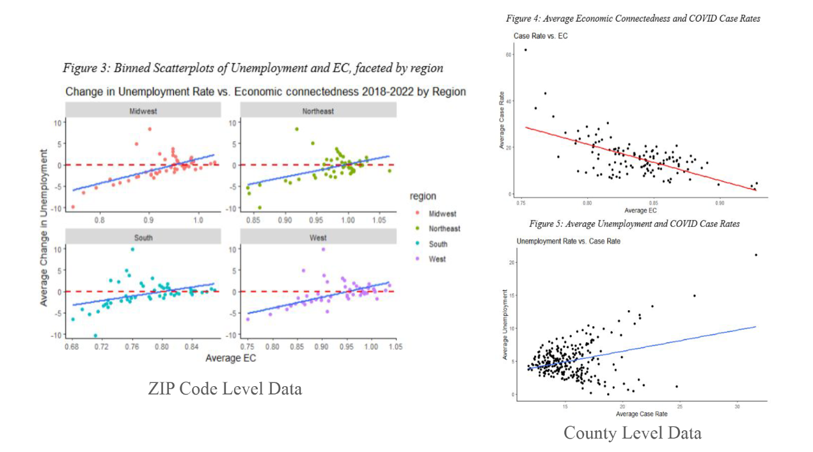
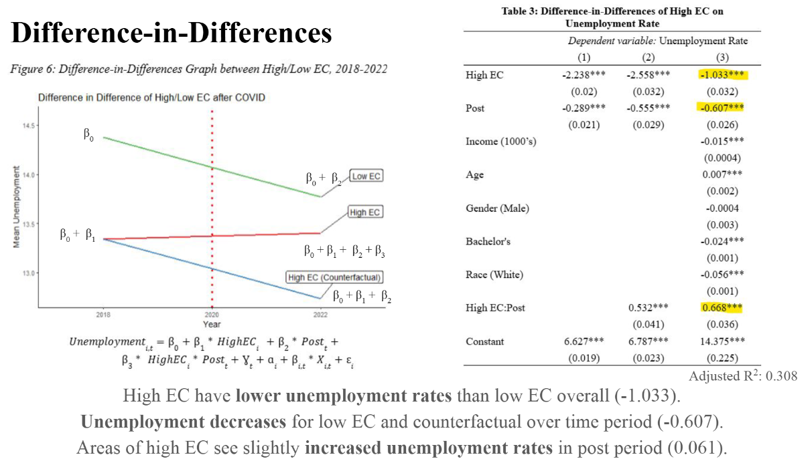
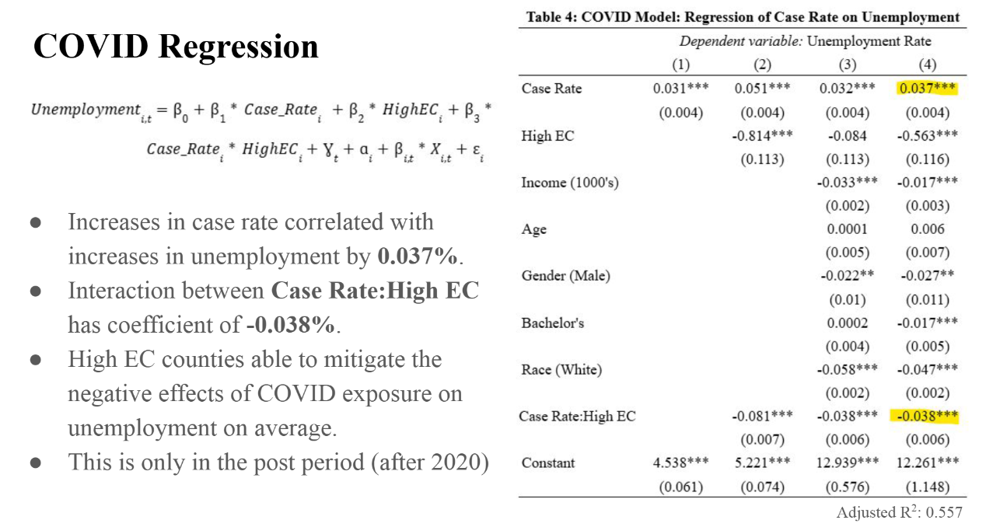

# Social Connection in Times of Economic Crisis: COVID-19 and Unemployment
### Abstract
This project examines the effect that social capital, mainly economic connectedness (EC), has on the economic response to the COVID-19 pandemic. For the purposes of this study, the effect that the COVID-19 pandemic had on unemployment levels across the United States was examined separately by ZIP code and county. Using a difference-in-differences framework, this project analyzes how economic connectedness is correlated with changes in unemployment at the ZIP code level. A second regression model builds on the previous by adding COVID-19 case rates at the county level. Results from the difference-in-differences analysis suggest that high EC ZIP codes show slight increases in unemployment as a result of COVID in the post period. However, the next regression model, directly incorporating COVID cases in the analysis, provided an interaction coefficient between case rates and EC. The outcome shows that areas of high EC were able to mitigate the effect that COVID exposure had on unemployment compared to areas of low EC, when higher case rates led to increases in unemployment overall. This implies that EC plays a role in managing the negative effects of the pandemic. Policy makers should explore developments that mix socio-economic classes to improve economic outcomes and strengthen communities.

### Information
Code file in R Markdown used for my UCR Honors Capstone Project. The code was used to produce all necessary visualizations and regressions for my analysis. Data files necessary are stored in the `data` folder. The final paper, slides presentation, and poster presentation have also been included.

Project completed for graduation with University Honors. Faculty-mentored by Dr. Veronica Sovero (UCR) and Dr. Bree Lang (UCSB). Presented at the PREDOC Research Conference at the World Bank in Washington, D.C., Auguest 2025.

### Preview

  
   
  
   
  
   
  
   
  
   

